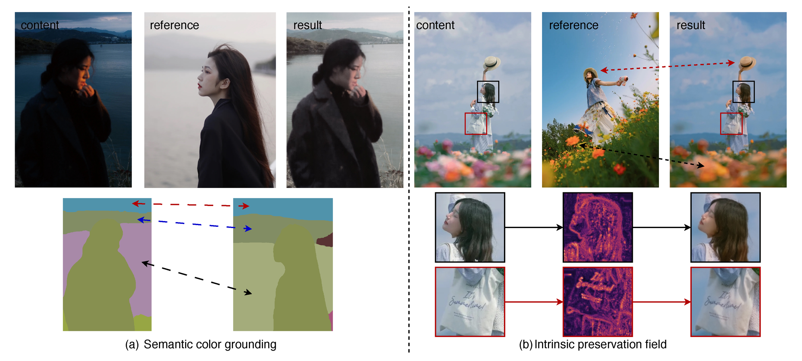

# SAGE-Color

**Semantic Appearance Grounding for Reference-Based Color Transfer**

SAGE-Color is a reference-based color transfer model. Given a content image and
a reference image, it transfers the reference image's palette, tone, contrast,
and region-level appearance while preserving the content image's geometry,
identity, layout, and fine structure.

The key idea is to treat the reference image as **chromatic evidence**, not as a
spatial template. The content image remains the authority for structure; the
reference image supplies appearance.

<p align="center">
  <a href="https://chenxib.github.io/sage-color/">
    
  </a>
  <a href="https://huggingface.co/chenxib/sage-color">
    
  </a>
  
  <a href="LICENSE">
    
  </a>
</p>

<p align="center">
  
</p>

## At a Glance

| Item | Details |
| --- | --- |
| Task | Reference-based color transfer |
| Input | One content image and one reference image |
| Output | Recolored content image with preserved structure |
| Base model | Stable Diffusion 3.5 Medium |
| Released weights | Final inference checkpoint and first-stage grounding checkpoint |
| License | CC BY 4.0 for this code release |

## Why SAGE-Color

- **Reference appearance without reference layout leakage.** The content image
  controls geometry, identity, layout, and fine details.
- **Semantic color grounding.** Reference colors are organized as global,
  regional, and local chromatic evidence instead of copied by pixel position.
- **Structure preservation.** The Intrinsic Preservation Field uses content-only
  structure cues to protect regions where color residuals could corrupt detail.
- **Practical release.** The repository includes inference scripts, training
  wrappers, environment files, setup utilities, and public checkpoints.

## Quick Start

Python 3.11, a CUDA-capable NVIDIA GPU, and `conda` are expected. The default
mixed precision is `bf16`.

### 1. Clone and Install

```bash
git clone https://github.com/chenxib/sage-color.git
cd sage-color

conda env create -f environment.yml
conda activate sage-color
bash scripts/bootstrap_external_diffusers.sh
pip install -r requirements.txt
```

### 2. Download Checkpoints

```bash
pip install -U huggingface_hub
bash scripts/download_weights.sh
```

This downloads:

| File | Purpose |
| --- | --- |
| `checkpoints/sage-color-final.pt` | Final checkpoint for normal inference. |
| `checkpoints/sage-color-grounding.pt` | First-stage color-grounding checkpoint for continued final-stage training. |

The checkpoints are hosted at
[huggingface.co/chenxib/sage-color](https://huggingface.co/chenxib/sage-color).

### 3. Download External Models

```bash
bash scripts/download_required_models.sh
```

External model paths are documented in [`model/README.md`](model/README.md).

### 4. Run Inference

```bash
CUDA_VISIBLE_DEVICES=0 \
CONTENT_IMAGE=path/to/content.png \
REFERENCE_IMAGE=path/to/reference.png \
OUTPUT_IMAGE=outputs/sage-color/sample.png \
bash scripts/final_model/bash/infer.sh
```

The default checkpoint path is `checkpoints/sage-color-final.pt`. To use a
different checkpoint:

```bash
CHECKPOINT=/path/to/sage-color-final.pt bash scripts/final_model/bash/infer.sh
```

## Repository Layout

```text
.
├── README.md
├── LICENSE
├── CITATION.cff
├── environment.yml
├── requirements.txt
├── docs/                         # GitHub Pages project page
├── model/README.md               # external model paths
├── checkpoints/README.md         # checkpoint placement notes
├── datasets/README.md            # JSONL data format
└── scripts/
    ├── bootstrap_external_diffusers.sh
    ├── download_required_models.sh
    ├── download_weights.sh
    ├── resolve_runtime.sh
    ├── stage1_training/          # reference color-grounding training
    └── final_model/              # final training and inference
```

Weights, datasets, generated outputs, local checkpoints, and the local Diffusers
checkout are ignored by Git.

## Method Summary

SAGE-Color frames reference-based color transfer as **semantic appearance
grounding**. The reference image should control color appearance, but it should
not control geometry or layout.

The model separates the problem into three paths:

- **Dense Content Path:** concatenates the noisy target latent and the content
  latent, anchoring layout and geometry to the content image.
- **Semantic Color Gallery:** represents reference appearance as global,
  regional, and local chromatic evidence indexed by semantic correspondence.
- **Intrinsic Preservation Field:** derives color-free content structure cues
  from achromatic statistics, depth, and optional segmentation/panoptic priors
  to protect structure-sensitive regions.

The full architecture and qualitative results are shown on the
[project page](https://chenxib.github.io/sage-color/).

## Data Format

Training uses JSONL. Each row should contain a content image, a reference image,
and a target image:

```json
{"content_image": "path/to/content.png", "reference_image": "path/to/reference.png", "target_image": "path/to/target.png"}
```

Batch inference also accepts:

```json
{"source": "path/to/content.png", "reference": "path/to/reference.png", "target": "path/to/target.png"}
```

Relative paths are resolved from the repository root.

## Training

SAGE-Color uses a recommended two-stage recipe:

1. Train reference color grounding.
2. Continue from the grounding checkpoint to train the final structure-preserving
   model.

### Stage 1: Color Grounding

Single GPU:

```bash
CUDA_VISIBLE_DEVICES=0 \
TRAIN_JSONL=datasets/train.jsonl \
OUTPUT_DIR=outputs/stage1 \
RESOLUTION=1024 \
TRAIN_BATCH_SIZE=2 \
LORA_RANK=128 \
MAX_TRAIN_STEPS=10000 \
CHECKPOINTING_STEPS=500 \
bash scripts/stage1_training/bash/train_single_gpu.sh
```

Multi GPU:

```bash
CUDA_VISIBLE_DEVICES=0,1,2,3 \
NUM_PROCESSES=4 \
TRAIN_JSONL=datasets/train.jsonl \
OUTPUT_DIR=outputs/stage1-ddp \
RESOLUTION=1024 \
TRAIN_BATCH_SIZE=2 \
LORA_RANK=128 \
MAX_TRAIN_STEPS=10000 \
CHECKPOINTING_STEPS=500 \
bash scripts/stage1_training/bash/train_multi_gpu.sh
```

Stage 1 saves:

```text
outputs/stage1/checkpoint-<step>/color_edit_stage1.pt
```

### Stage 2: Final Model

Single GPU:

```bash
CUDA_VISIBLE_DEVICES=0 \
TRAIN_JSONL=datasets/train.jsonl \
INIT_FROM_STAGE1_CHECKPOINT=checkpoints/sage-color-grounding.pt \
OUTPUT_DIR=outputs/final-model \
RESOLUTION=1024 \
TRAIN_BATCH_SIZE=2 \
LORA_RANK=128 \
MAX_TRAIN_STEPS=10000 \
CHECKPOINTING_STEPS=500 \
LEARNING_RATE=2e-5 \
COLOR_LOSS_WEIGHT=0.05 \
bash scripts/final_model/bash/train_single_gpu.sh
```

Multi GPU:

```bash
CUDA_VISIBLE_DEVICES=0,1,2,3 \
NUM_PROCESSES=4 \
TRAIN_JSONL=datasets/train.jsonl \
INIT_FROM_STAGE1_CHECKPOINT=checkpoints/sage-color-grounding.pt \
OUTPUT_DIR=outputs/final-model-ddp \
RESOLUTION=1024 \
TRAIN_BATCH_SIZE=2 \
LORA_RANK=128 \
MAX_TRAIN_STEPS=10000 \
CHECKPOINTING_STEPS=500 \
LEARNING_RATE=2e-5 \
COLOR_LOSS_WEIGHT=0.05 \
bash scripts/final_model/bash/train_multi_gpu.sh
```

The final checkpoint is saved as:

```text
outputs/final-model/checkpoint-<step>/color_edit_final.pt
```

## Smoke Test

For a minimal smoke run on limited memory, set `RESOLUTION=128` or
`RESOLUTION=256`, `TRAIN_BATCH_SIZE=1`, `LORA_RANK=16`,
`MAX_TRAIN_STEPS=1`, `NUM_WORKERS=0`, and
`DISABLE_CHECKPOINT_VALIDATION=1`.

## License and Dependencies

This project is released under the
[Creative Commons Attribution 4.0 International License](LICENSE).

This code release depends on third-party model licenses, including Stable
Diffusion 3.5 Medium and the feature extractors listed in
[`model/README.md`](model/README.md). Users are responsible for complying with
the licenses of those dependencies.

The Colorist-200K and Colorist-Bench-1K assets are described in the paper, but
full redistribution may be restricted by the authors' data-use agreements.

## Citation

The arXiv identifier and final citation will be added after public release.
